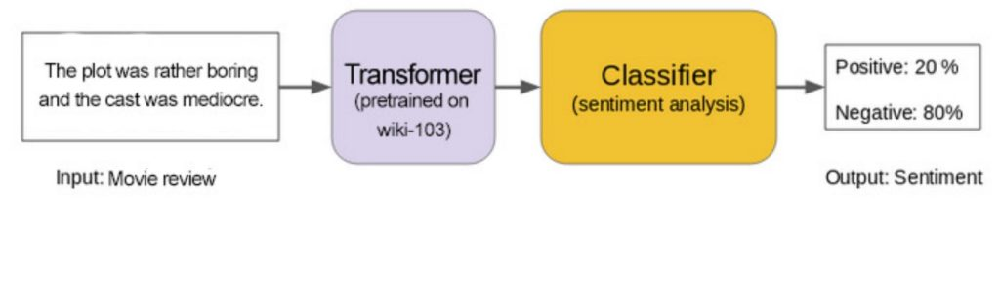
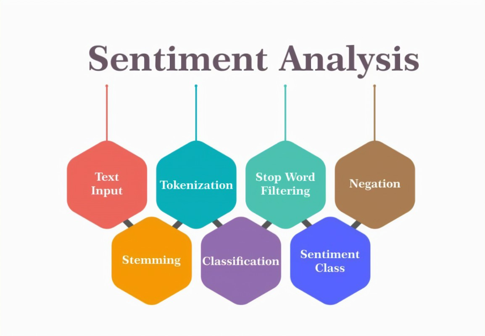

# Sentiment-Analysis

Sentiment analysis is a subset of Natural Language Processing (NLP). It is a data mining technique that measures and tries to understand people's opinions and stances through NLP. Computational linguistics and text analysis inspect information from the web, social media, and many other online sources. This data assesses people's emotions, sentiments, beliefs, or viewpoints, so it is also called opinion mining. Essentially, companies utilize NLP to inspect people's moods in society.

Essentially, sentiment analysis (or opinion mining) is the approach that identifies the emotional tone and attitude behind a body of text. So how does this come into play in our world? Since the internet has become an integral part of life, so has social media. When we search, post, and engage online—whether on social media or elsewhere—we can create influence or become influenced. This makes sentiment a potent weapon, as political campaigns, marketing campaigns, businesses, and prediction-based decision-making are all grounded in sentiment analysis.
 

